# 个人简历

## 联系方式

* 手机：136 5716  8500
* Email：1@aakuan.cn
* 微信号：kuankuank

## 个人信息

* 黄宽/男/1993
* 本科/湖北工业大学
* 工作年限：5年
* Github：<http://github.com/akkentt>

## 技能清单

* 熟练原生Javascript、ES6、TypeScript语法编写代码，熟练flex、Sass、webpack、Vite、Babel、Echart等技术的使用
* 熟练Vue原理及使用、熟练Vue3.0使用，熟练Vue-SSR服务端渲染框架Nuxt.js的原理和使用，熟练Vant、Element-UI、MintUI、WeUI、iView、vux、MUI、Layui、Muse-UI、Materialize等常用前端框架的使用
* 熟练小程序开发，包括原生小程序以及mpvue、wepy等小程序框架的开发
* 熟练Git/SVN/TFS等源代码管理工具使用
* 熟练前端性能优化，了解前后端、HTTP协议等相关安全知识，并具有实际应用经验
* 熟练跨平台开发，包括Electron、uniapp、以及原生Flutter-APP应用开发
* 熟悉C#/Winform后端开发，熟练Node.js后端开发，熟练使用crawler、puppeteer编写爬虫应用
* 熟悉SQL Server/MySql数据库开发
* 熟熟悉搜索引擎爬虫特性，熟练从技术角度解决SEO优化问题
* 熟悉sentry异常监控、熟悉Fiddler等抓包工具排查问题
* 熟悉Linux系统操作，了解一般命令的使用
* 熟悉使用Apache/IIS/express/node-pm2等应用部署和管理应用
* 了解逆向编程，对程序反汇编感兴趣
* 兴趣原因入行，愿意主动学习
* 逻辑思路清晰，具备良好的理解能力，乐于分享和沟通。

  
# 工作经历

## 中原集团 （ 2017年2月 ~ 至今 ）

### 香港House730移动站官网
**日期：** 2020.4-2020.7     
**相关技术：** Nuxt.js/Vant/Vue/webpack/express/pm2/docker     
中原旗下类似房天下、安居客的房源信息发布平台，针对香港和海外地区开放，因此使用i18n实现了国际化，主要使用Vue-SSR方案的Nuxt.js框架开发，解决了首屏渲染和SEO的问题。本人主要负责项目技术选型，框架搭建，解决成员在开发中遇到的各种疑难杂症，并参与项目部分模块的开发，包括用户注册、登陆以及地图找房模块的开发。

### 中原IM聊天小程序
**日期：** 2019.8-2019.10     
**相关技术：** Wepy/vant-weapp/sass/babel/webpack/webscoket   
用于中原企业对外服务客户的IM小程序客服系统，早前使用小程序框架mpvue开发，后续采用wepy框架进行了重构， 通过集成第三方通讯服务商网易云信(主要为socket消息推送)，开发了一套完整的IM聊天系统，包括会话列表、会话详情、成员管理、聊天同步、消息检索、好友邀请等功能

### 中原地产官网移动站
**日期：** 2017.4-2017.6     
**相关技术：** Vuex/vue-ssr/Material/Echart/ sass/babel/webpack/IIS     
针对新房、二手房相关租售信息发布平台，使用Vue全家桶开发，包括Vue-Router、Sass、Axios、VueX、webpack、Express等技术。前端UI框架为Material Design，并使用了针对SEO端的Nuxt.js的服务端渲染框架，个人负责该项目技术选型，框架搭建，业务统筹，以及部分功能(首页、房贷计算器、租售委托、房价走势等)的实现。通过此项目，更深入理解了Vue框架的设计模式。

## 上海步步亿佰科技有限公司(2016.2-2017.2)

### 物流TT移动端
**日期：**  2016.10-2016.12    
**技术：** MUI/html5+/jquery/IIS    
基于H5/CSS3的WebAPP形式开发的物流行业服务软件，前端使用MUI框架开发，数据交互采用JSON数据类型，AJAX调用API传输，该项目一共分为收件录单、派领件、签收扫描、业务员、异常上报、退货扫描、退货登记、数据统计等功能模块。完善的货物操作流程，满足物流、快递企业基础操作。本人主要负责前端页面搭建、首页统计、异常上报、收件录单(快速收件，完整录单)、到件扫描等模块。

### 申通航空货代管理系统
**日期：**  2016.02-2016.05   
**技术：**  bootstrap/Echart/jqMobi/jquery/IIS     
该系统为中国知名物流行业申通快递公司开发，使用VS2010开发，项目后台框架使用WCF+MVC（公司自有框架）开发，数据库使用Sql Server，前端框架使用了基于BootStrap的前框框架。IOS/Andorid端使用了基于Html5的前端框架jqMobi开发（WebApp形式）。功能模块包括申通快递站点维护、区域维护，代理商维护，以及各个报表模块，其中报表使用的Echarts可视化数据交互。

## 项目预览
**中原地产官网（PC）：**<https://tj.centanet.com/>      
**中原地产官网(M)：**<https://m.sz.centanet.com>     
**中原用户中心(响应式)：**<https://passport.centanet.com/>    
**PMS730（PC）：**<https://pms.house730.com/>     
**House730(M)：**<https://m.house730.com>    

## 在校期间作品

### 酒店管理系统
---
#### 2013年大二参赛作品 使用asp.net开发(C#) 获得特等奖
<a data-fancybox title="" href="./.vuepress/public/assets/zp-1.png">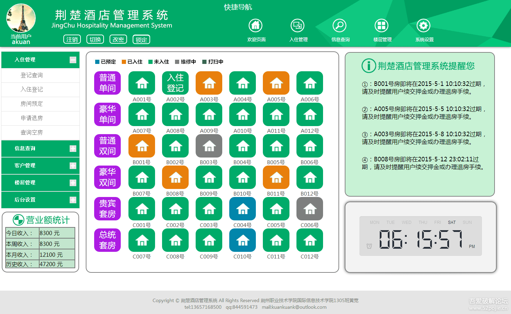</a>
<a data-fancybox title="" href="./.vuepress/public/assets/zp-2.png">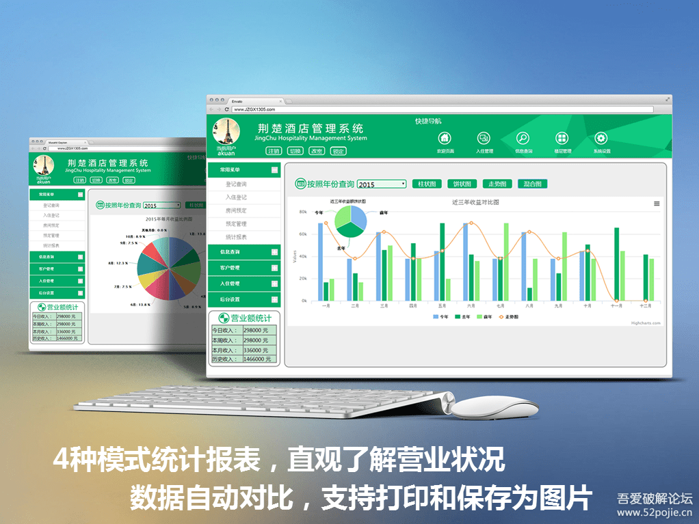</a>

  

### 考勤办公系统
---
#### 2014年大三 厚溥杯软件大赛 参赛作品 使用asp.net开发(C#) 获得二等奖
<a data-fancybox title="" href="./.vuepress/public/assets/zp-3.png">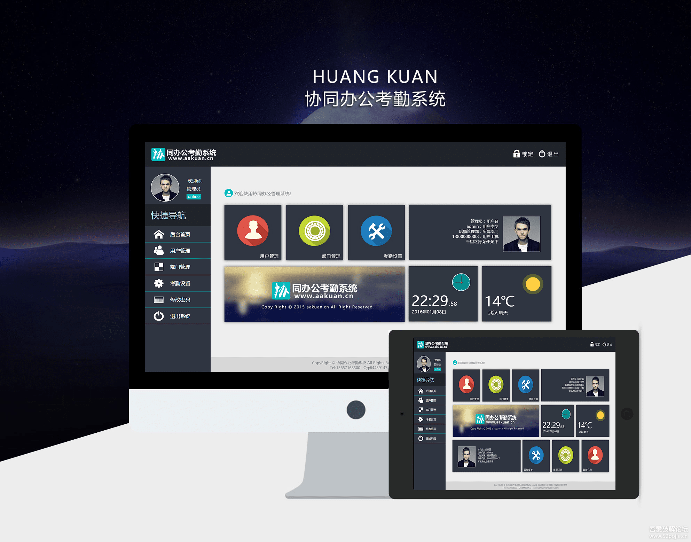</a>
<a data-fancybox title="" href="./.vuepress/public/assets/zp-4.png">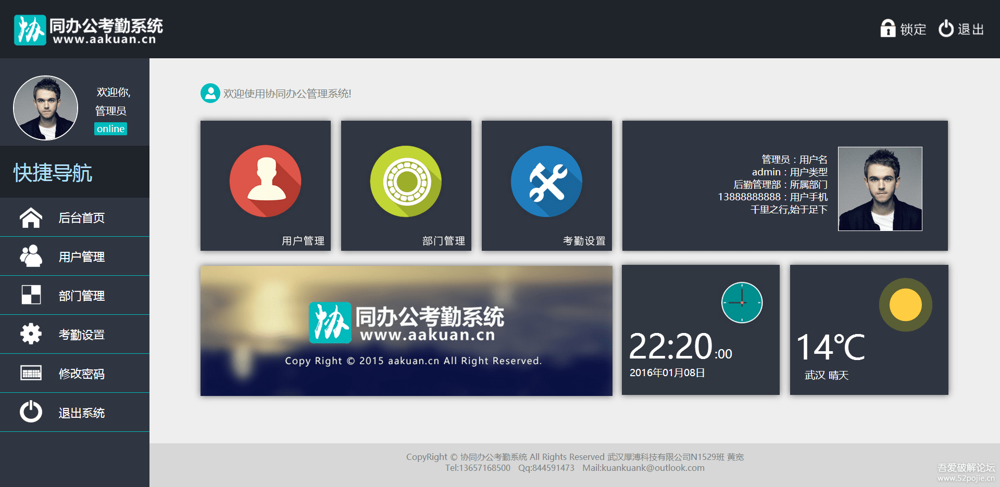</a>

  

### 云上的日子 音乐电台
---
#### 2015年  个人兴趣开发，主要抓取网易云、QQ音乐API，可解析播放下载付费、无版权音乐，开源后高峰期时月访问量30万+，后考虑资源版权问题停止维护
<a data-fancybox title="" href="./.vuepress/public/assets/zp-5.png">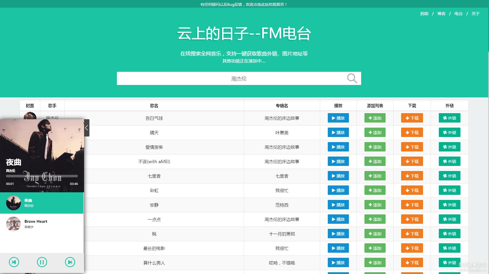</a>
<a data-fancybox title="" href="./.vuepress/public/assets/zp-6.png">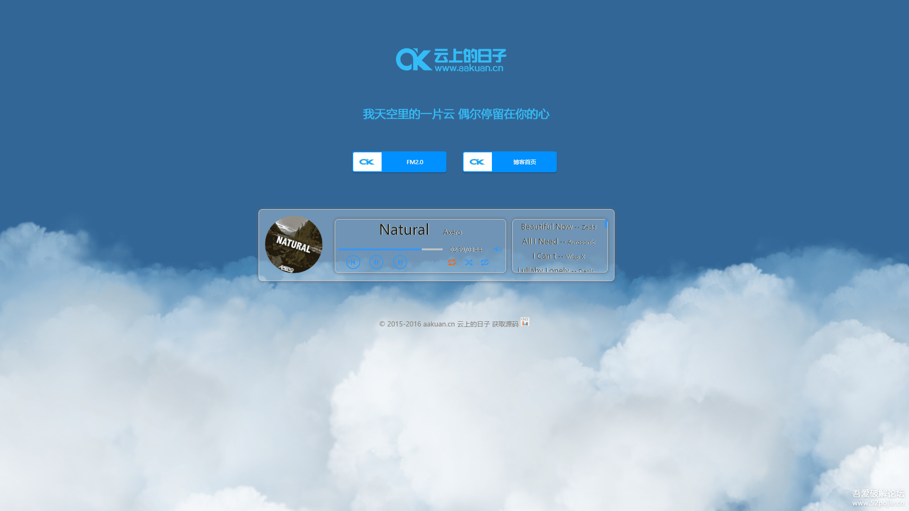</a>

  

## 工作期间项目

### 移动端项目
---
#### 2017年4月开始陆续开发，包括中原官网、中原IM小程序等项目，目前处于持续迭代维护状态

<a data-fancybox title="" href="./.vuepress/public/assets/xm-1.jpg">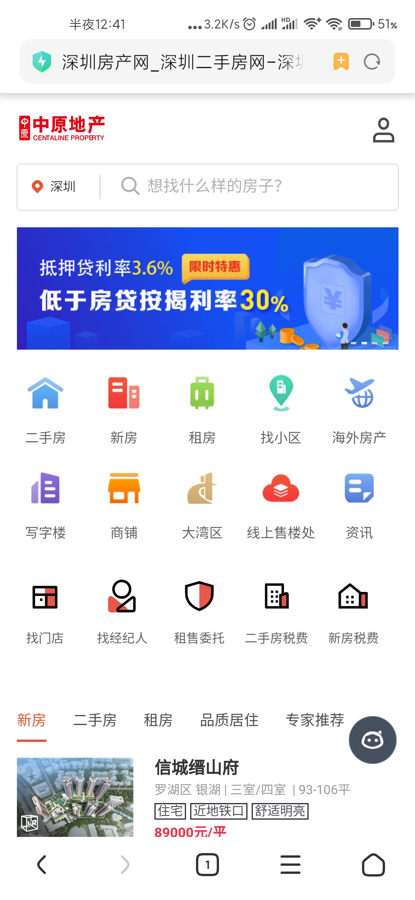</a>
<a data-fancybox title="" href="./.vuepress/public/assets/xm-2.jpg">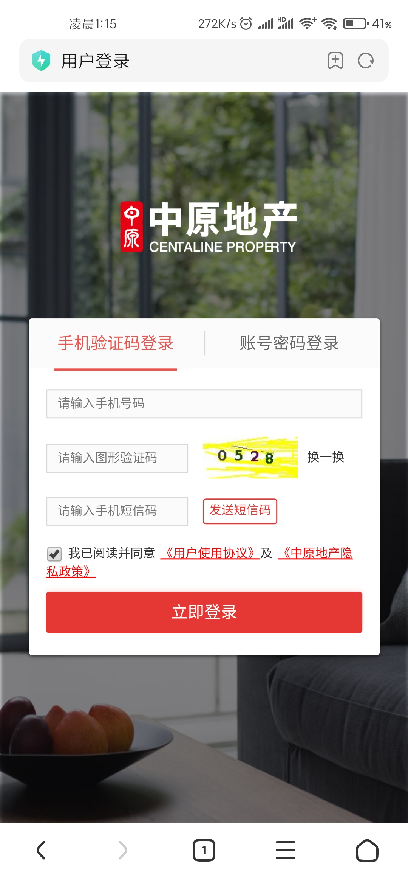</a>
<a data-fancybox title="" href="./.vuepress/public/assets/xm-3.jpg">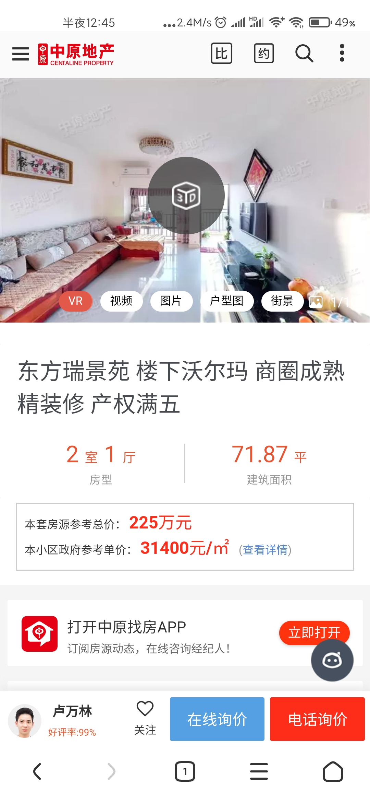</a>
<a data-fancybox title="" href="./.vuepress/public/assets/xm-4.jpg">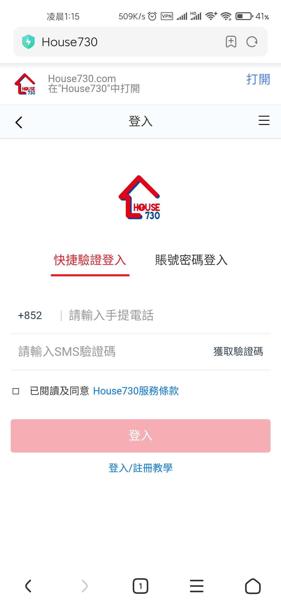</a>
<a data-fancybox title="" href="./.vuepress/public/assets/xm-5.jpg">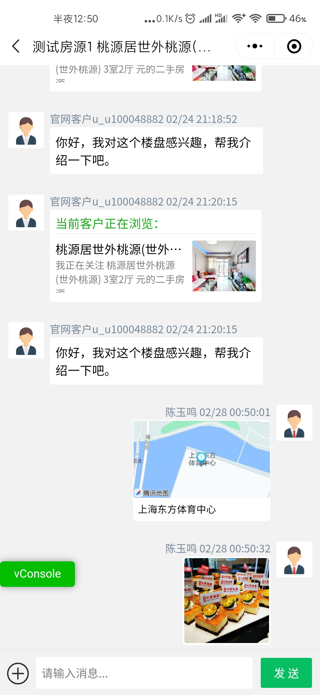</a>
<a data-fancybox title="" href="./.vuepress/public/assets/xm-6.jpg">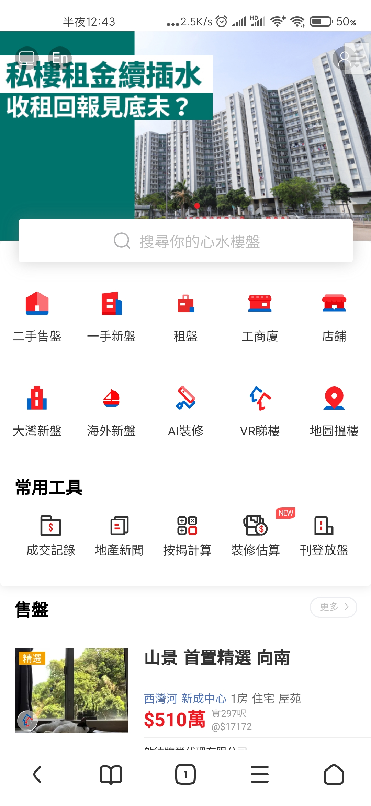</a>

  

### PC端项目
---
#### 2018年3月开始陆续开发，包括中原官网、House730等项目，目前处于持续迭代维护状态

<a data-fancybox title="" href="./.vuepress/public/assets/pc-1.png">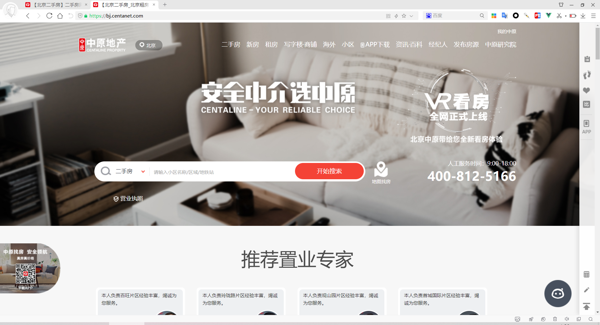</a>
<a data-fancybox title="" href="./.vuepress/public/assets/pc-2.png">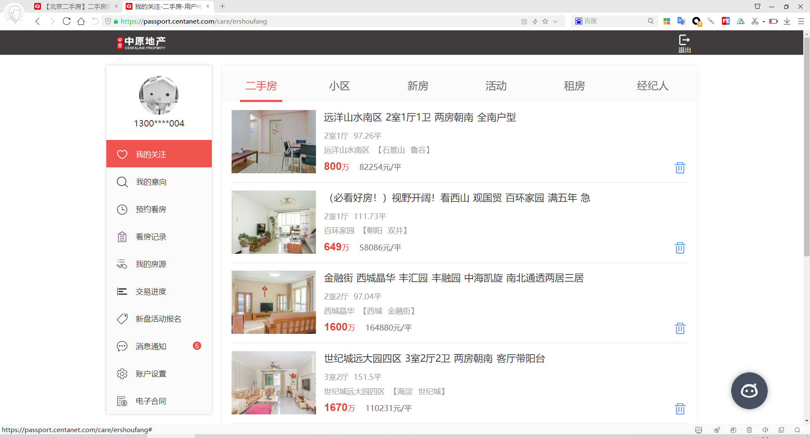</a>
<a data-fancybox title="" href="./.vuepress/public/assets/pc-3.png">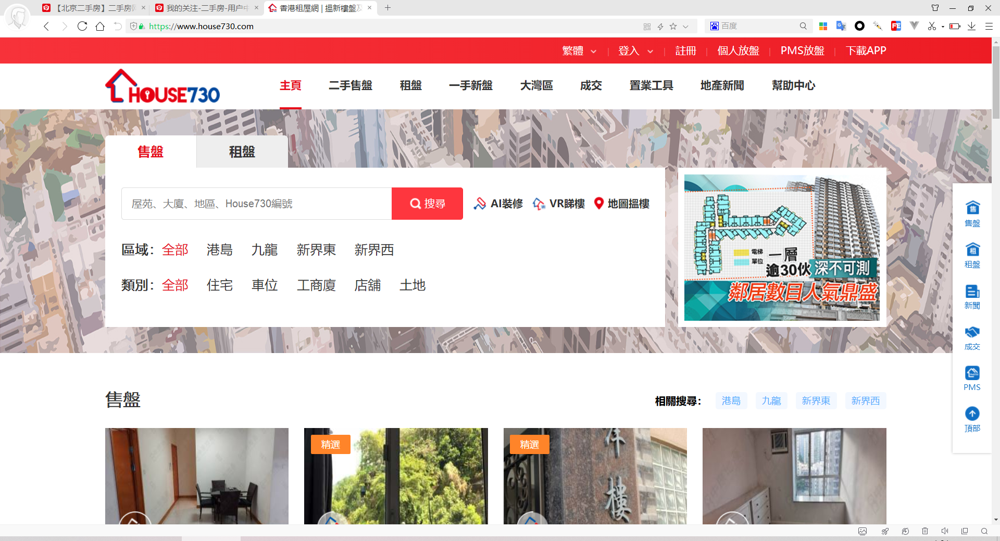</a>
<a data-fancybox title="" href="./.vuepress/public/assets/pc-4.png">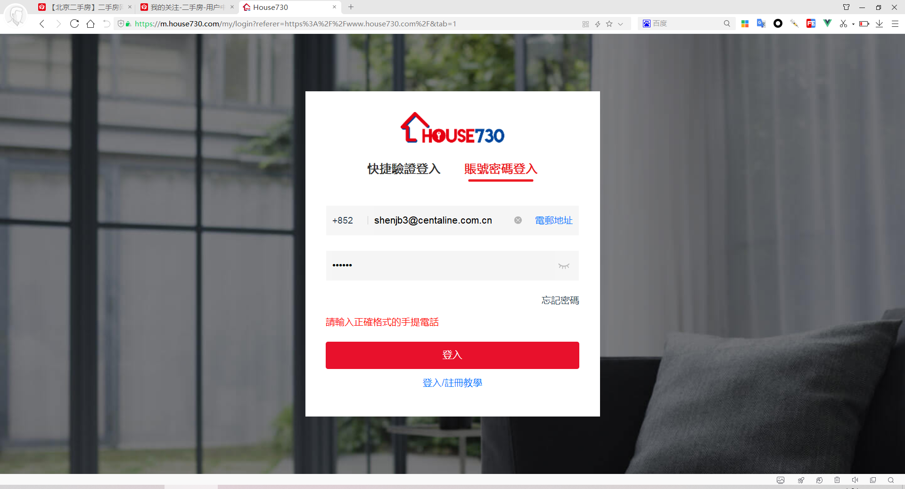</a>

  

 

